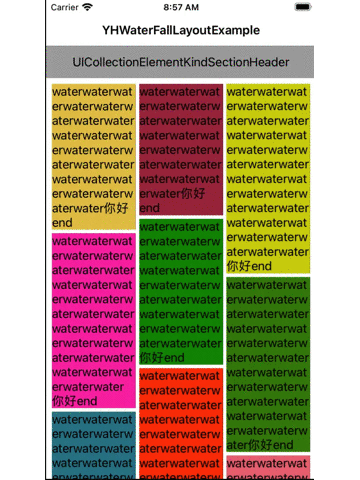

# YHWaterFallLayout
瀑布流简易使用

## Features


## Installation

### CocoaPods (recommended practice)
1. Add following content
```ruby
pod 'YHWaterFallLayout', :git => 'https://github.com/yelinux/YHWaterFallLayout.git'
```
 to your `Podfile`.
 
2. Run `pod install` or `pod update`.

### Manually (old school way)
1. Drag the `YHWaterFallLayout` folder into your project.

2. Add the following to your `.pch` file.
```objective-c
#import "YHWaterFallLayout.h"
```

## Usage
1. Add the following to your view controller file:
```objective-c
#import "YHWaterFallLayout.h"
```

2. Create an instance object of collectionViewLayout:`YHWaterFallLayout`
```objective-c
YHWaterFallLayout *layout = [[YHWaterFallLayout alloc] init];
layout.minimumLineSpacing = 5;
layout.minimumInteritemSpacing = 5;
layout.sectionInset = UIEdgeInsetsMake(8, 8, 8, 8);
layout.delegate = self;
UICollectionView *collectionView = [[UICollectionView alloc] initWithFrame:self.view.bounds collectionViewLayout:layout];
```

3. Configure the delegate: `YHWaterFallLayoutDelegate`                                          
```objective-c
//@optional
-(CGSize)yHWaterFallLayout:(YHWaterFallLayout *)layout sizeForSupplementaryElementOfKind:(NSString *)kind atIndexPath:(NSIndexPath *)indexPath{
    if ([kind isEqualToString:UICollectionElementKindSectionHeader]) {
    } else {
    }
}
//@required
-(CGSize)yHWaterFallLayout:(YHWaterFallLayout *)layout sizeForItemAtIndexPath:(NSIndexPath *)indexPath{
    
}
```

4. Configure other UICollectionView's delegate and datasource: `UICollectionViewDelegate, UICollectionViewDataSource` 
```objective-c
//@optional
- (NSInteger)numberOfSectionsInCollectionView:(UICollectionView *)collectionView{
}
//@optional
-(UICollectionReusableView *)collectionView:(UICollectionView *)collectionView viewForSupplementaryElementOfKind:(NSString *)kind atIndexPath:(NSIndexPath *)indexPath{
}
//@required
-(NSInteger)collectionView:(UICollectionView *)collectionView numberOfItemsInSection:(NSInteger)section{
}
//@required
-(__kindof UICollectionViewCell *)collectionView:(UICollectionView *)collectionView cellForItemAtIndexPath:(NSIndexPath *)indexPath{
}
```

🎉🎉🎉 Congratulations! Everything was done!!! You will get what you want!!! 🌈🌈🌈
